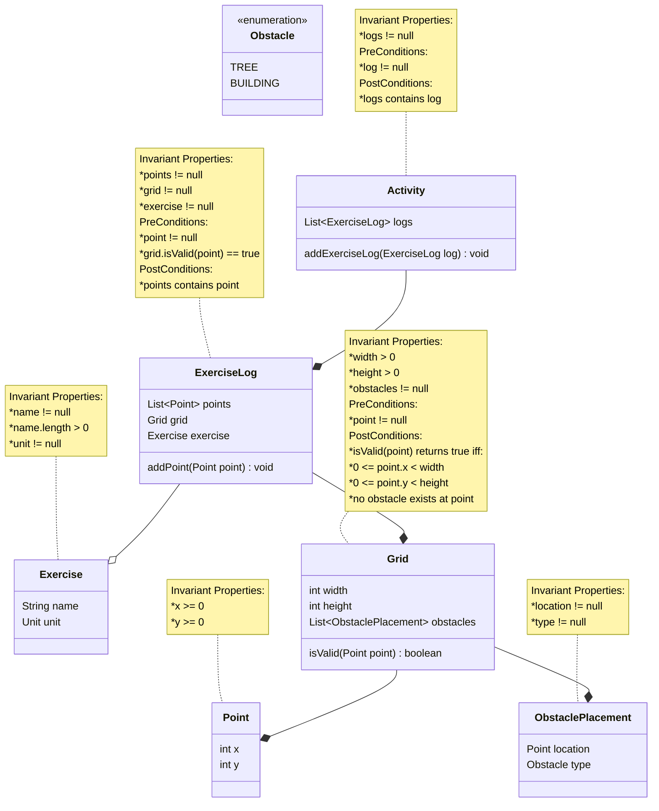

## Domain model
### Diagram

Here is the diagram for my Exercise tracker app this has the minimal requirements needed I also made it so you could give the exercise a name and the unit to measure it so we can choose a exercise we would like to track and not have it tied down to one exercise

## REPL Commands

| Command | Description |
|---------|-------------|
| `HELP` | Lists all available commands and input formats |
| `ADD MAP` | Initialize the map with width and height |
| `ADD OBSTACLE` | Add a rectangular obstacle to the map |
| `ADD ACTIVITY` | Track a new activity with a route |
| `SHOW MAP` | Display the map with all routes and obstacles |
| `SHOW OBSTACLES` | List all obstacles on the map |
| `SHOW ACTIVITIES` | List all tracked activities |
| `SHOW ACTIVITY` | Display map with a single activity's route |
| `REMOVE ACTIVITY` | Remove an activity by ID |
| `REMOVE OBSTACLE` | Remove an obstacle by ID |
| `REMOVE MAP` | Remove the entire map and all data |
| `QUIT` / `EXIT` | Exit the application |

## Input Formats

- **Coordinates**: Space-separated integers (e.g., `3 5`)
- **Activities**: Identified by numeric ID
- **Obstacles**: Identified by numeric ID
- **Obstacle types**: `TREE`, `BUILDING`, `ROCK`, `WATER`
- **Units**: `KILOMETERS`, `MILES`, `METERS`, `STEPS`

## Map Symbols

| Symbol | Meaning |
|--------|---------|
| `.` | Empty location |
| `>` | Activity route point |
| `*` | Obstacle |
