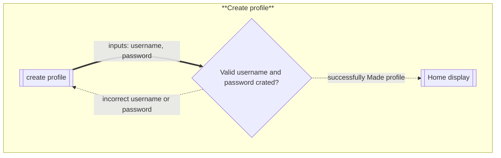
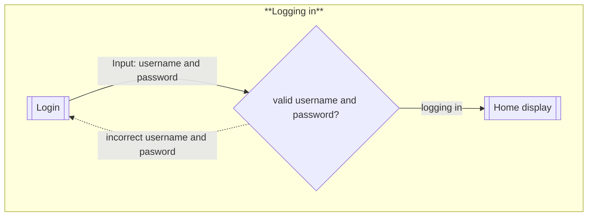
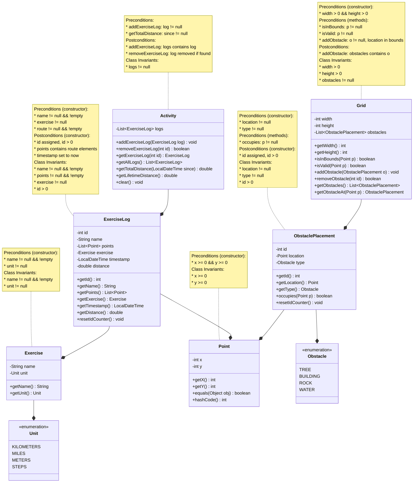

# REPL

### Building and Running the REPL

The project has been built and tested to be run in IntelliJ. Open the project
there, open the "ca.umanitoba.cs.kanand" folder, then the "Main.java" file.
Finally, click "Run" in the top menu bar!

### Additional Commands

I've added the following commands to support the Exercise Tracker application:

* `ADD MAP` - Initialize the map with a specified width and height!
* `ADD OBSTACLE` - Add a rectangular obstacle to the map!
* `ADD ACTIVITY` - Track a new activity with a route on the map!
* `SHOW MAP` - Display the map with all routes and obstacles!
* `SHOW OBSTACLES` - List all obstacles on the map!
* `SHOW ACTIVITIES` - List all tracked activities!
* `SHOW ACTIVITY` - Display map with a single activity's route!
* `REMOVE ACTIVITY` - Remove an activity by ID!
* `REMOVE OBSTACLE` - Remove an obstacle by ID!
* `REMOVE MAP` - Remove the entire map!
### Flow of interaction diagrams
#### Create Profile

#### Logging in 

#### Log activities and add grid 

```mermaid
flowchart 
subgraph **Log user activities and route**
home[[Home display]]
addMap[add map]
addObstacle[Add obstcle to map]
addPoint[Add Route]
logout[[logout]]
showMap[show updated map]
enterExercise[Add exercise]
follow[follow users]
home --> edit[edit]
edit -- input: password or username --> user{new password or usernme valid?} 
user -. invalid change .-> edit
user -- change selected username or password --> home
home --> follow -- input: select users to follow from feed --> followUser{follow selected user}
followUser -. cancel .-> home
home -->enterExercise -- input: enter exercise --> validExercise{Valid exercise}
validExercise -. invalid exercise or cancel, enter again .-> enterExercise
validExercise -- add to exercise log and feed --> addMap
addMap -- input: grid size --> validGrid{Valid grid size?} -- make map with the grid size --> addPoint
validGrid -. invalid grid size or cancel, enter again .-> addMap
addPoint -- input: copy route or log new route --> option{copy route or new route}
option -. chose to copy route .-> selectRoute[choose route to copy] -- input: user selects route to copy --> routeFits{route fits current map?} 
routeFits -. route selected does not fit or cancel, enter again .-> selectRoute
option -. cancelled .-> addPoint
option -. chose new route .-> newRoute[add new route] -- input: starting and end point --> validPoint{valid point?} -- add route --> addObstacle
validPoint -. invalid point or cancelled, enter again .-> newRoute
routeFits -- add route --> addObstacle
addObstacle -- input: if user wants obstacle entered --> optionObstacle{enter obstacale?} -. user chose yes.-> enterObstacale -- input: obstacle type and points --> validObstacle{valid obstacle?} --> showMap
optionObstacle -. chose not to enter obstacle .-> showMap
home --> logout
end
```

## Domain model

### Resources

* I learned about Java design patterns and domain modeling at
  <https://www.baeldung.com/>.
* I referenced constraint checking practices from Guava library documentation.

### Changes

* I realized when implementing my flow of interaction that
  `Exercise` really should include a `Unit` to measure the exercise properly.
* I needed to add `ObstaclePlacement` to represent obstacles on the grid!
* I created an `ExerciseLog` to track individual exercises with their routes on a grid.
* I implemented a `Grid` class to validate exercise routes and manage obstacles.

### Diagram 

Here is the updated diagram for my domain model. This design allows tracking exercises on a grid with obstacles, supporting flexible exercise types measured in different units.

