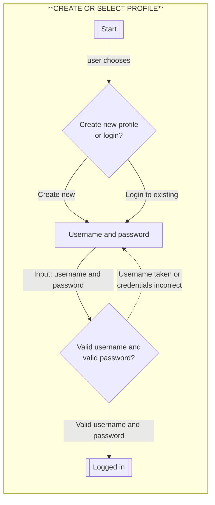
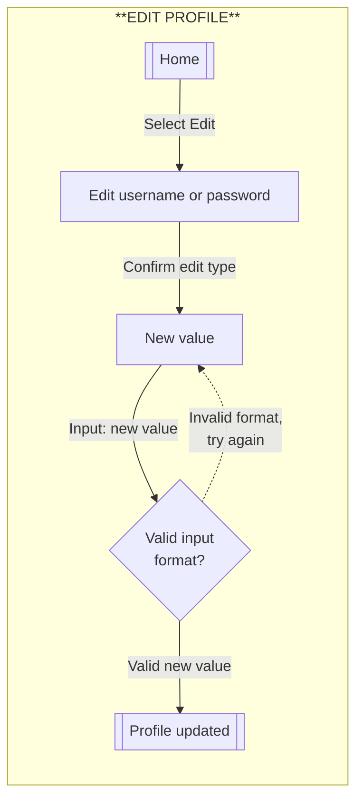
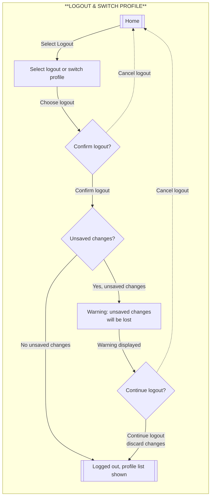
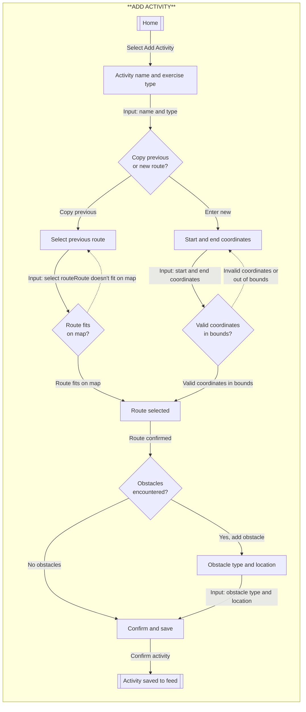
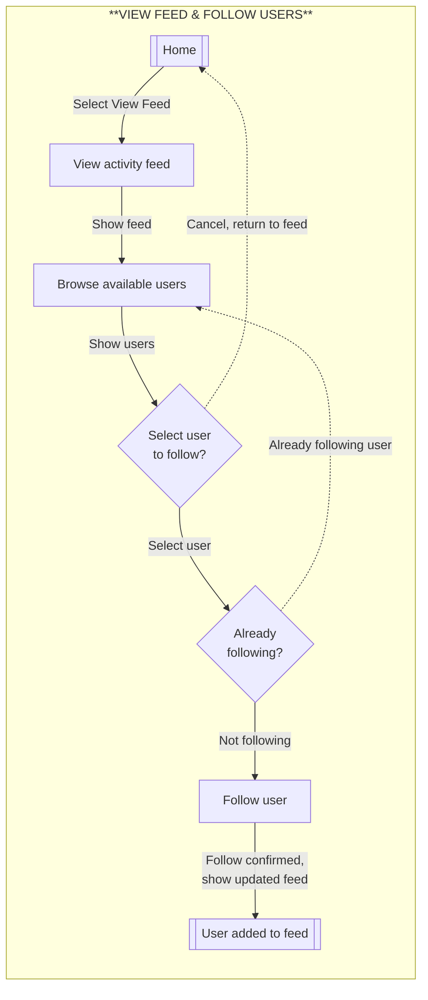
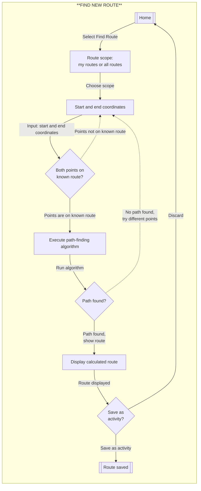

# Flows of Interaction

User interaction flows for all Phase 3 tasks. Each flow shows the happy path and error cases (dotted lines) using appropriate flowchart symbols: processes (rectangles), decisions (diamonds), and terminal points (rounded).

## Resources

*mermaid flow chart syntax: <https://mermaid.ai/open-source/syntax/flowchart.html>

## Diagrams

### Create or Select User Profile

### Edit User Profile

### Logout and Switch Profile

### Add New Activity

### Follow Users and View Feed

### Find New Route (Path-Finding)

# REPL

## Building and Running the REPL

The project has been built and tested to be run in IntelliJ. Open the project
there, open the "ca.umanitoba.cs.kanand" folder, then the "Main.java" file.
Finally, click "Run" in the top menu bar!

## Additional Commands

I've added the following commands to support the Exercise Tracker application:

* `CREATE PROFILE` - Create a new user profile with username and password
* `LOGIN` - Select and login to an existing user profile
* `LOGOUT` - Log out of current profile
* `EDIT PROFILE` - Modify username or password
* `FOLLOW USER` - Follow another user to see their activities in feed
* `SHOW FEED` - Display activity feed from followed users
* `ADD MAP` - Initialize the world map with specified width and height
* `ADD ACTIVITY` - Track a new activity with a route on the map
* `SHOW ACTIVITY` - Display map with a single activity's route
* `ADD OBSTACLE` - Add an obstacle to the map
* `FIND ROUTE` - Use path-finding to discover new routes on the map
* `SHOW OBSTACLES` - List all obstacles on the map
* `REMOVE ACTIVITY` - Remove an activity by ID
* `REMOVE OBSTACLE` - Remove an obstacle by ID
* `REMOVE MAP` - Remove the entire map
* `EXIT` - Quit the application

## Domain Model

### Resources

* I learned about Java design patterns and domain modeling at
  <https://www.baeldung.com/>.
* I learned about stack data structures and linked list implementations from
  <https://www.geeksforgeeks.org/stack-data-structure-introduction-and-program/>.
* I referenced constraint checking practices from Guava library documentation
  <https://github.com/google/guava>.
* I studied graph traversal and path-finding algorithms at
  <https://www.baeldung.com/java-graphs#dfs-stack>.

### Changes

**For Phase 3, I made the following significant changes to support multi-user functionality, activity feeds, and path-finding:**

* **Added `User` class** - Represents a user profile with username, password, and owned activities. Supports multiple people using the same application instance.

* **Added `Stack` interface and `LinkedStack` implementation** - Required for the stack-based path-finding algorithm. `Stack` defines push/pop operations; `LinkedStack` implements using a linked list structure. Invariants and contracts are fully specified through preconditions, postconditions, and state requirements in the Javadoc.

* **Added `StackNode` inner class** - Used by `LinkedStack` for linked list structure. Includes invariant that `data != null` and maintains proper node chaining for path-finding algorithm.

* **`Grid` class as hard-coded map** - The map is hard-coded and initialized when the software starts. It begins completely empty with no obstacles, but users can add obstacles as they encounter them during activities. Also maintains reference to which points have been covered by routes, enabling path-finding queries.

* **Added `RouteScope` enum** - Supports two path-finding modes: "MY_ROUTES_ONLY" (personal activities) or "ALL_ROUTES" (from feed with followed users).

### Diagram

Here is the domain model for the Exercise Tracker. This design supports multi-user profiles, activity tracking on a hard-coded grid map, path-finding with stack ADT, and activity feeds for following other users. **All invariants are documented in class notes** to ensure the model maintains valid states at all times.

```mermaid
classDiagram
    class User {
        -String username
        -String password
        -Activity activity
        -List~User~ following
        
        +getUsername() String
        +authenticate(String pwd) boolean
        +getActivity() Activity
        +addFollowing(User user) void
        +removeFollowing(User user) void
        +getFollowing() List~User~
    }
    
    note for User "Invariant properties:
        * username not null/empty
        * username unique
        * password not null/empty
        * activity != null
        * following != null
        * user can only access/modify own activities
        "

    class Activity {
        -List~ExerciseLog~ logs
        
        +addExerciseLog(ExerciseLog log) void
        +removeExerciseLog(int id) boolean
        +getExerciseLog(int id) ExerciseLog
        +getAllLogs() List~ExerciseLog~
    }
    
    note for Activity "Invariant properties:
        * logs != null
        * all ids > 0
        * all logs belong exclusively to owning user
        "

    class ExerciseLog {
        -int id
        -String name
        -List~Point~ points
        -Exercise exercise
        -LocalDateTime timestamp
        
        +getId() int
        +getName() String
        +getPoints() List~Point~
        +getExercise() Exercise
        +getTimestamp() LocalDateTime
    }
    
    note for ExerciseLog "Invariant properties:
        * id > 0
        * name not null/empty
        * points not null/empty
        * exercise != null
        * timestamp <= now
        "

    class Exercise {
        -String name
        -Unit unit
        
        +getName() String
        +getUnit() Unit
    }
    
    note for Exercise "Invariant properties:
        * name not null/empty
        * unit != null
        "

    class Grid {
        -int width
        -int height
        -List~ObstaclePlacement~ obstacles
        -Set~Point~ coveredPoints
        
        +getWidth() int
        +getHeight() int
        +isInBounds(Point p) boolean
        +addObstacle(ObstaclePlacement o) void
        +removeObstacle(int id) boolean
        +getObstacles() List~ObstaclePlacement~
        +addCoveredPoint(Point p) void
        +isCovered(Point p) boolean
    }

    class Point {
        -int x
        -int y
        
        +getX() int
        +getY() int
        +equals(Object) boolean
        +hashCode() int
    }
    
    note for Point "Invariant properties:
        * x >= 0
        * y >= 0
        "

    class ObstaclePlacement {
        -int id
        -Point location
        -Obstacle type
        
        +getId() int
        +getLocation() Point
        +getType() Obstacle
    }
    
    note for ObstaclePlacement "Invariant properties:
        * id > 0
        * location not null
        * type != null
        "

    class Stack {
        <<interface>>
        +push(Object item) void
        +pop() Object
        +peek() Object
        +isEmpty() boolean
        +size() int
    }
    
    note for Stack "
        Preconditions:
        * pop: !isEmpty()
        * peek: !isEmpty()
        Postconditions:
        * push: size increases by 1
        * pop: size decreases by 1, item returned is from top
        * peek: size unchanged, item returned is from top
        * size: returns number of items on stack
        "
    


    class LinkedStack {
        -StackNode head
        
        +push(Object item) void
        +pop() Object
        +peek() Object
        +isEmpty() boolean
        +size() int
    }
    
    note for LinkedStack "
        Preconditions:
        * pop: !isEmpty()
        * peek: !isEmpty()
        Postconditions:
        * push: item added to head, size increases
        * pop: head.data returned and removed, size decreases
        * peek: head.data returned without removal
        * isEmpty: true iff head == null
        * size: counts all nodes reachable from head
        Invariant properties:
        * head == null iff empty
        * all nodes reachable from head
        "

    class StackNode {
        -Object data
        -StackNode next
        
        +getData() Object
        +getNext() StackNode
        +setNext(StackNode node) void
    }
    
    note for StackNode "Inner class of LinkedStack
        Invariant properties:
        * data != null
        "

    class Obstacle {
        <<enumeration>>
        TREE
        BUILDING
        ROCK
        WATER
    }

    class Unit {
        <<enumeration>>
        KILOMETERS
        MILES
        METERS
        STEPS
    }

    class RouteScope {
        <<enumeration>>
        MY_ROUTES_ONLY
        ALL_ROUTES
    }

    %% Relationships
    User *-- Activity
    User o-- "*" User
    
    Activity *-- "*" ExerciseLog
    ExerciseLog *-- "*" Point
    ExerciseLog *-- Exercise
    Exercise *-- Unit
    
    Grid *-- "*" ObstaclePlacement
    Grid o-- "*" Point
    
    ObstaclePlacement *-- Point
    ObstaclePlacement *-- Obstacle
    
    LinkedStack *-- StackNode
    StackNode o-- StackNode
    Stack <|.. LinkedStack
    
    note for Grid "Invariant properties:
        * width > 0
        * height > 0
        * obstacles != null
        * coveredPoints != null
        * hard-coded and initialized at startup
        "
```

