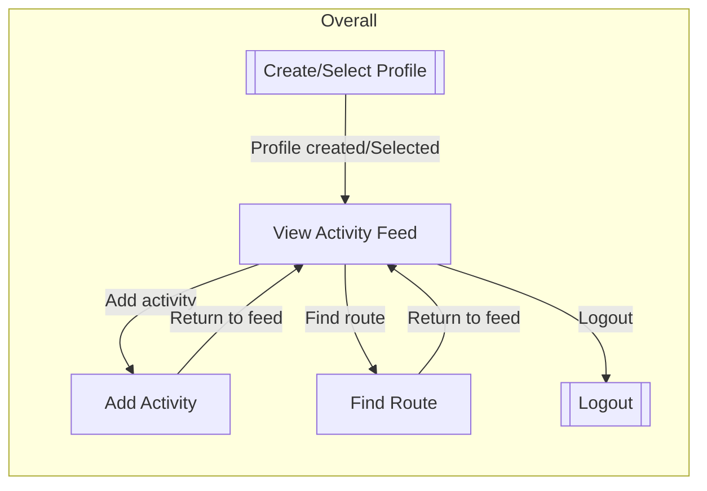
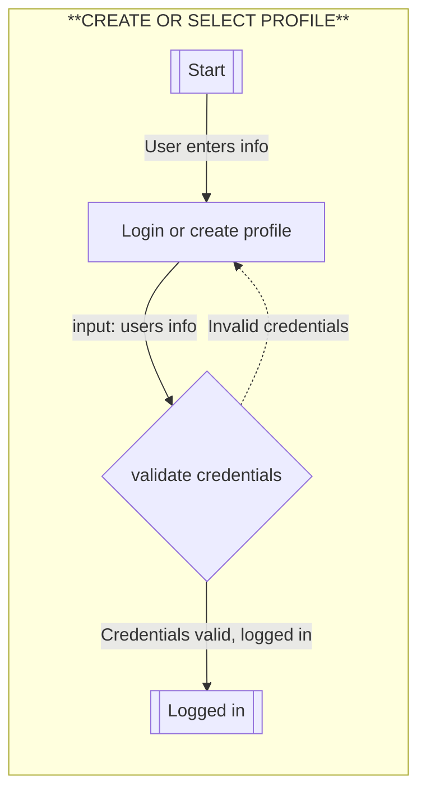
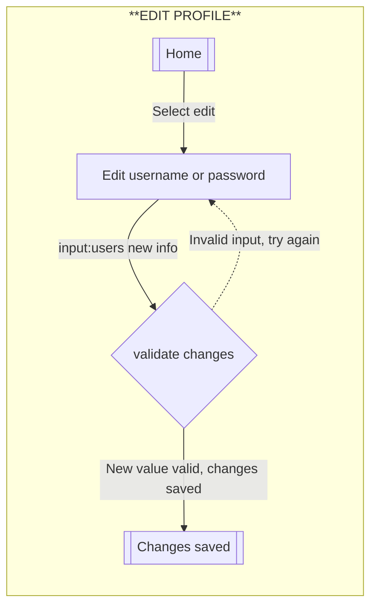
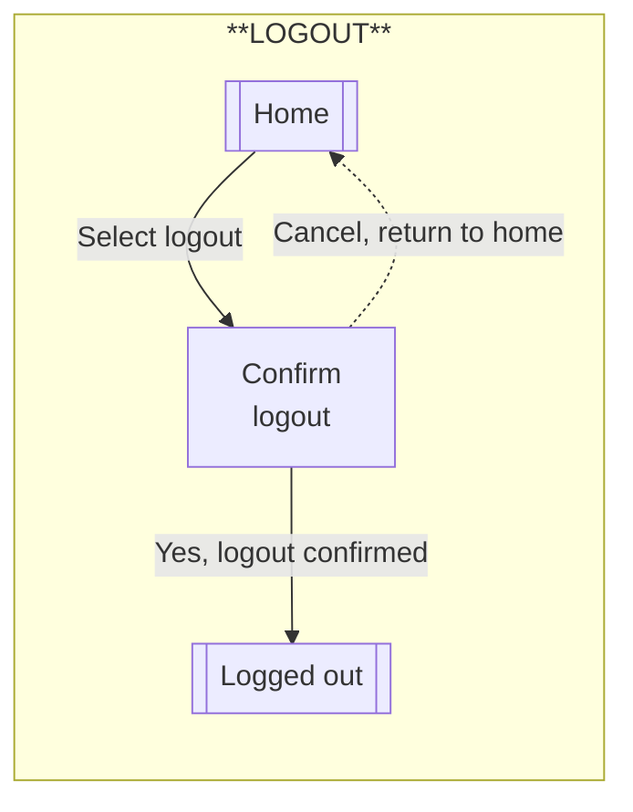
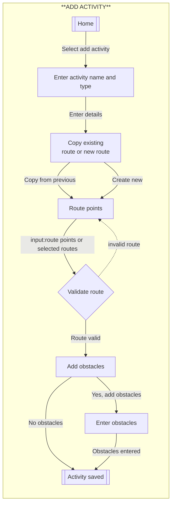
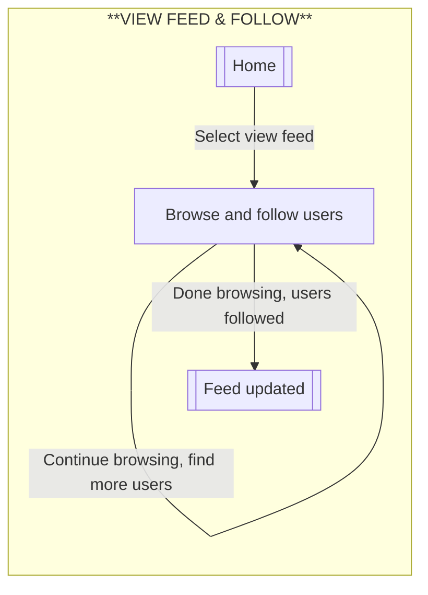
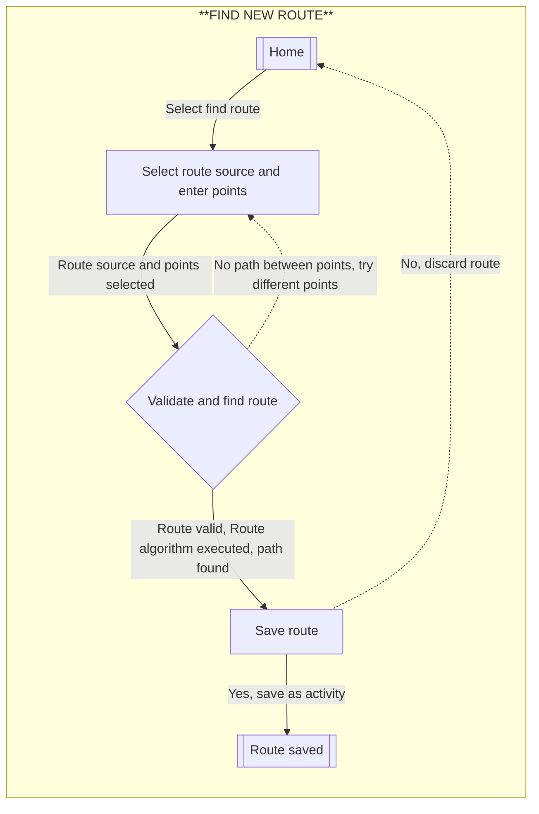
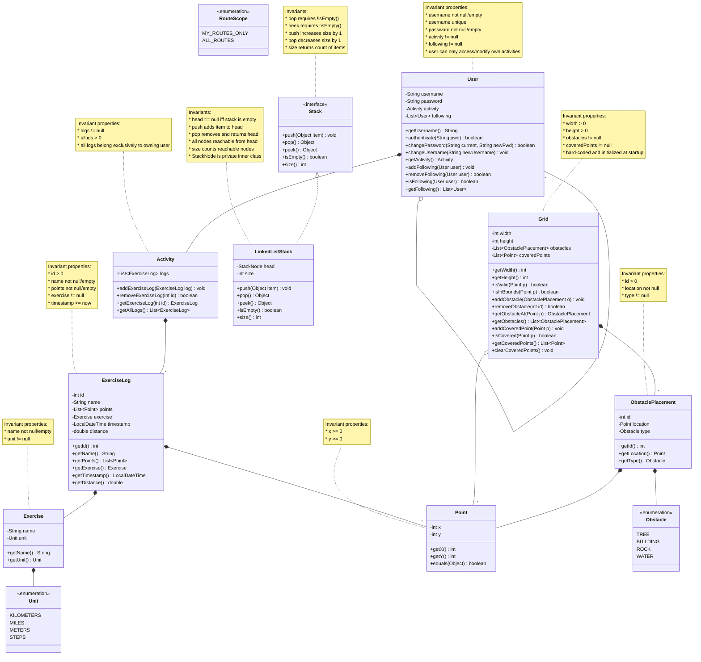

## Resources

*mermaid flow chart syntax: <https://mermaid.ai/open-source/syntax/flowchart.html>

# Flows of Interaction

## Diagrams

### Overall Flow



#### Create or Select User Profile



#### Edit User Profile



#### Logout



#### Add Activity



#### View Feed & Follow Users



#### Find New Route


## Additional Commands

I've added the following commands to support the Exercise Tracker application:

* `CREATE PROFILE` - Create a new user profile with username and password
* `LOGIN` - Select and login to an existing user profile
* `LOGOUT` - Log out of current profile
* `EDIT PROFILE` - Modify username or password
* `FOLLOW USER` - Follow another user to see their activities in feed
* `SHOW FEED` - Display activity feed from followed users
* `ADD MAP` - Initialize the world map with specified width and height
* `ADD ACTIVITY` - Track a new activity with a route on the map
* `SHOW ACTIVITY` - Display map with a single activity's route
* `ADD OBSTACLE` - Add an obstacle to the map
* `FIND ROUTE` - Use path-finding to discover new routes on the map
* `SHOW OBSTACLES` - List all obstacles on the map
* `REMOVE ACTIVITY` - Remove an activity by ID
* `REMOVE OBSTACLE` - Remove an obstacle by ID
* `REMOVE MAP` - Remove the entire map
* `EXIT` - Quit the application

## Domain Model

### Resources

* I learned about Java design patterns and domain modeling at
  <https://www.baeldung.com/>.
* I learned about stack data structures and linked list implementations from
  <https://www.geeksforgeeks.org/stack-data-structure-introduction-and-program/>.
* I referenced constraint checking practices from Guava library documentation
  <https://github.com/google/guava>.
* I studied graph traversal and path-finding algorithms at
  <https://www.baeldung.com/java-graphs#dfs-stack>.

### Changes

**For Phase 3, I made the following significant changes to support multi-user functionality, activity feeds, and path-finding:**

* **Added `User` class** - Represents a user profile with username, password, and owned activities. Supports multiple people using the same application instance.

* **Added `Stack` interface and `LinkedListStack` implementation** - Required for the stack-based path-finding algorithm. `Stack` defines push/pop operations; `LinkedListStack` implements using a linked list structure with a private inner `StackNode` class. Invariants and contracts are fully specified through preconditions, postconditions, and state requirements in the Javadoc.

* **`Grid` class as hard-coded map** - The map is hard-coded and initialized when the software starts. It begins completely empty with no obstacles, but users can add obstacles as they encounter them during activities. Also maintains reference to which points have been covered by routes, enabling path-finding queries.

* **Added `RouteScope` enum** - Supports two path-finding modes: "MY_ROUTES_ONLY" (personal activities) or "ALL_ROUTES" (from feed with followed users).

### Diagram

Here is the domain model for the Exercise Tracker. This design supports multi-user profiles, activity tracking on a hard-coded grid map, path-finding with stack ADT, and activity feeds for following other users. **All invariants are documented in class notes** to ensure the model maintains valid states at all times.



## Persistence

The application uses **JSON-P** (JSR 353) with the **GlassFish** reference implementation to persist user data. All users, their exercise logs, and following relationships are saved to a JSON file (`exercise-tracker-data.json`) and automatically loaded on startup.

* Data is saved after: creating a user, changing username/password, adding an exercise log, and following/unfollowing a user.
* Following relationships are serialized as username references and restored by matching after all users are loaded.

## Testing a Stack

The COMP 2450 stack dependency provides a `Stack<T>` interface with five methods. Five implementations (`BadStack1`–`BadStack5`) were tested against the interface contract. One implementation has no bugs; the other four each contain a distinct bug.

### Test Data

The table below lists the test data used for each method of the `Stack` interface. Each test covers either a **general case** (typical usage) or an **edge case** (boundary/unusual condition).

| Method      | Test Description                                  | Type    | Input / Setup                         | Expected Result                          |
|-------------|---------------------------------------------------|---------|---------------------------------------|------------------------------------------|
| `isEmpty()` | New stack is empty                                | Edge    | freshly constructed stack             | `true`                                   |
| `isEmpty()` | Stack with one pushed element is not empty        | General | `push("hello")`                       | `false`                                  |
| `isEmpty()` | Stack after pushing 5 elements is not empty       | General | `push(0)` through `push(4)`           | `false`                                  |
| `size()`    | New stack has size 0                              | Edge    | freshly constructed stack             | `0`                                      |
| `size()`    | Push increments size correctly                    | General | `push(10)`, `push(20)`, `push(30)`    | `1`, then `2`, then `3`                  |
| `push()`    | Push single element, stack not empty              | General | `push("hello")`                       | `isEmpty()` returns `false`              |
| `push()`    | Push after emptying the stack                     | Edge    | `push(1)`, `pop()`, `push(99)`        | `size()` == 1, `peek()` == 99           |
| `peek()`    | Peek returns top element                          | General | `push(100)`, `push(200)`              | `200`                                    |
| `peek()`    | Peek does not change size                         | General | `push(1)`, `push(2)`, `peek()`        | size before == size after                |
| `peek()`    | Peek on empty stack throws exception              | Edge    | freshly constructed stack             | throws `EmptyStackException`             |
| `pop()`     | Pop returns top element                           | General | `push(10)`, `push(20)`                | `20`                                     |
| `pop()`     | Pop decrements size                               | General | push 3 items, pop once                | size == 2, then pop again → size == 1    |
| `pop()`     | LIFO order preserved                              | General | `push(1)`, `push(2)`, `push(3)`       | pop returns `3`, `2`, `1` in order       |
| `pop()`     | Single push then pop empties stack                | Edge    | `push(42)`, `pop()`                   | value == 42, `isEmpty()`, `size()` == 0  |
| `pop()`     | Pop all elements to empty                         | Edge    | push 3 items, pop 3 times             | `isEmpty()` == true, `size()` == 0       |
| `pop()`     | Pop on empty stack throws exception               | Edge    | freshly constructed stack             | throws `EmptyStackException`             |
| mixed       | Mixed push/pop/peek sequence                      | Edge    | push 10, push 20, pop, push 30, peek, pop | pop→20, peek→30, pop→30, size→1     |

### Bug Descriptions

**BadStack1** — `push()` does not store elements.
`push()` increments the internal size counter but never actually adds the element to the underlying data structure. As a result, `isEmpty()` correctly reports `true` even after pushing, and `pop()` / `peek()` throw `EmptyStackException` because there is nothing to retrieve. Only `size()` appears to work because it relies on the counter alone.

**BadStack2** — `pop()` does not remove the top element.
`pop()` returns the correct top value but never actually removes the element from the stack and does not decrement the size. The stack behaves as if `pop()` is `peek()` — repeated pops return the same element and the size never decreases.

**BadStack3** — `size()` is off by one.
`size()` consistently returns one less than the actual number of elements in the stack. After one push, `size()` returns 0. After five pushes, `size()` returns 4. The actual push, pop, peek, and isEmpty operations all work correctly; only the size count is wrong.

**BadStack4** — `peek()` clears the entire stack.
`peek()` returns the correct top element but as a side effect resets the stack's size to 0 and removes all elements. Any subsequent `pop()` or `peek()` call throws `EmptyStackException`. This makes `peek()` destructive rather than a read-only operation.

**BadStack5** — No bugs found. All 15 tests pass. This is the correct implementation.

## Running the Test Suite

To compile and run all tests through the test harness:

```bash
mvn compile test-compile
mvn exec:java -Dexec.mainClass=ca.umanitoba.cs.kanand.test.TestHarness -Dexec.classpathScope=test
```

