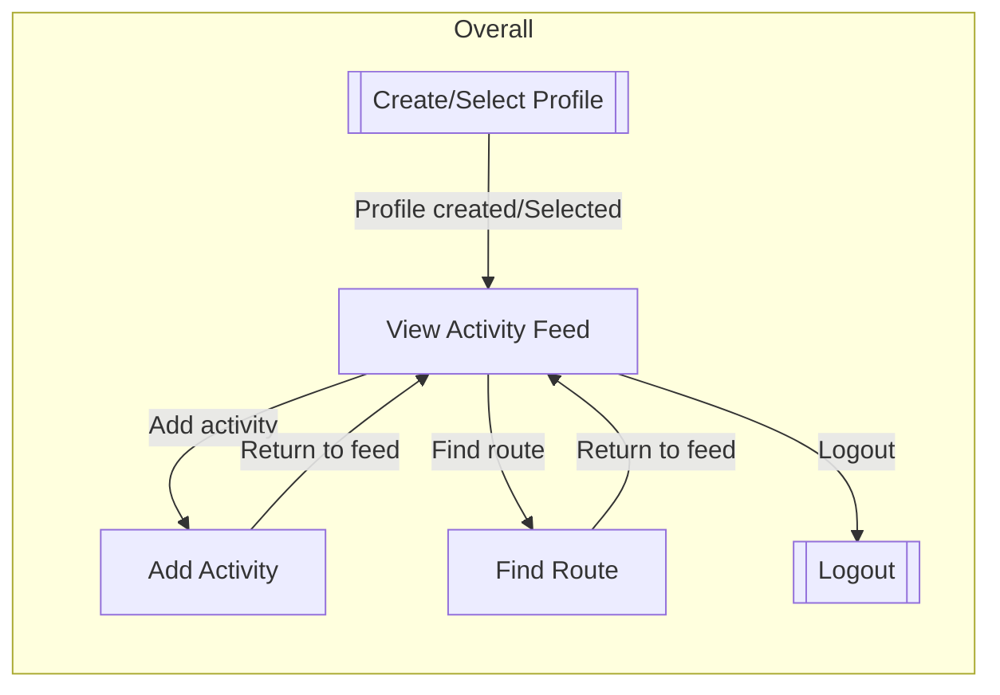
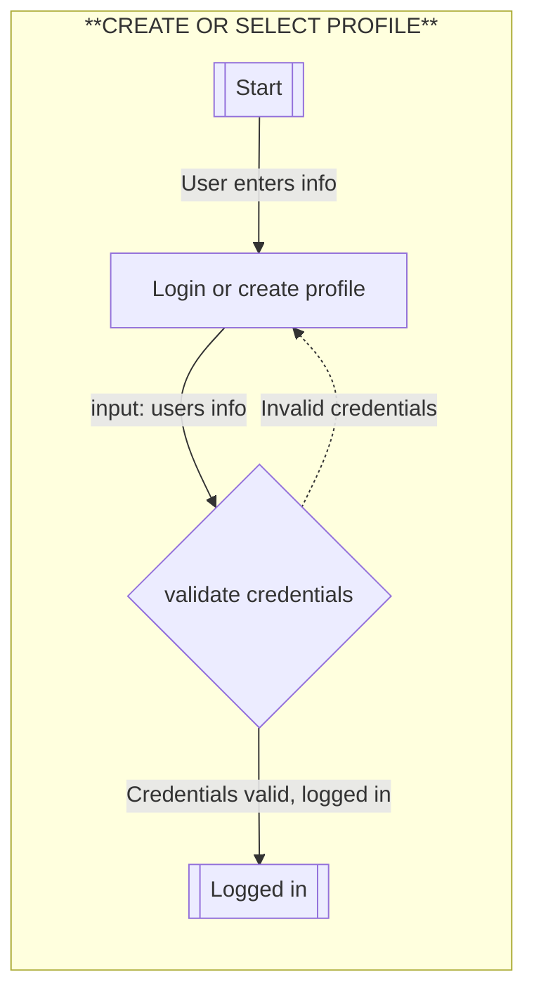
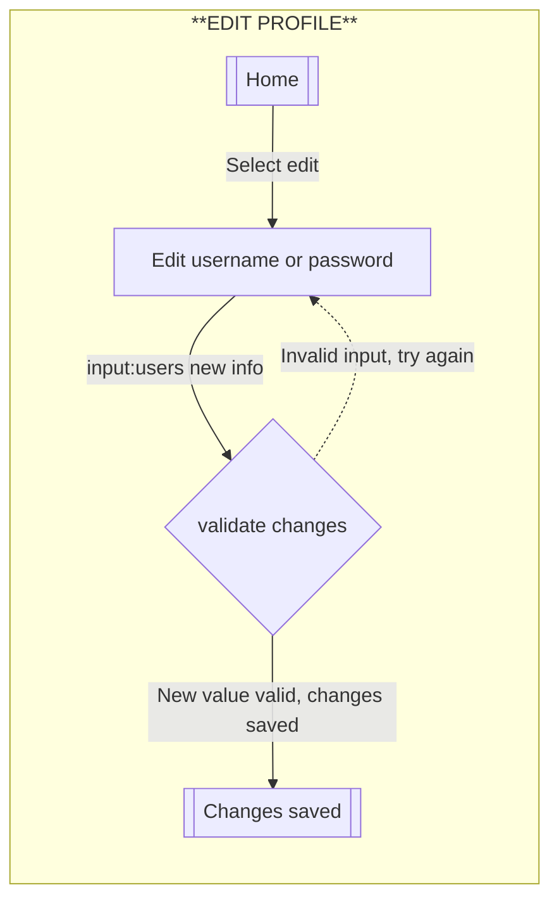
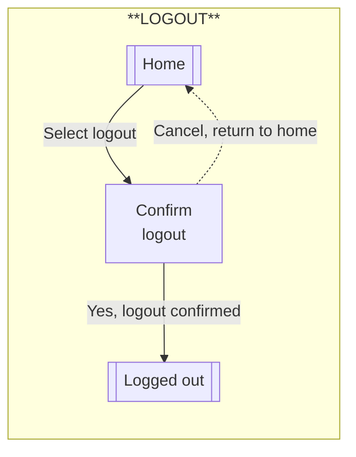
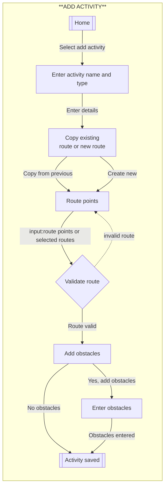
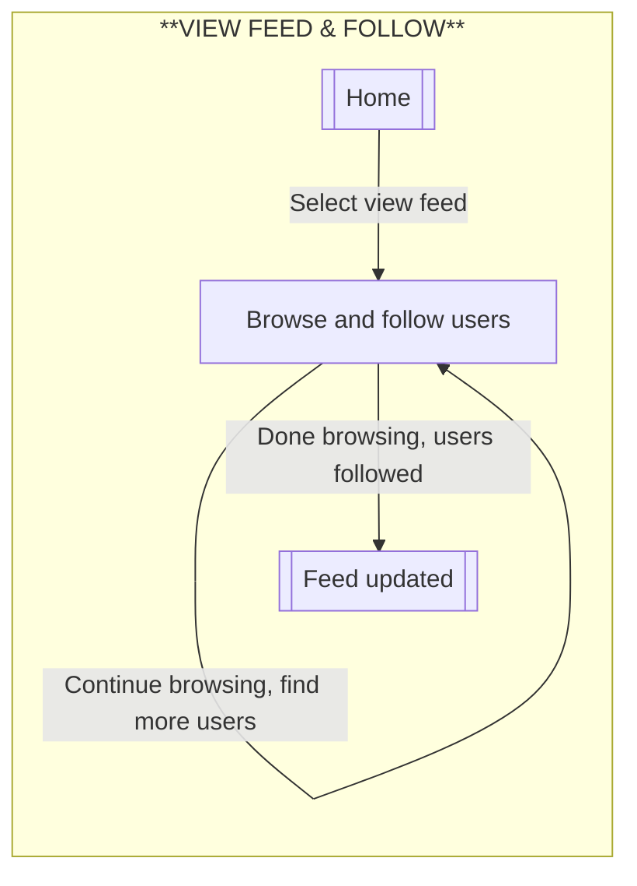
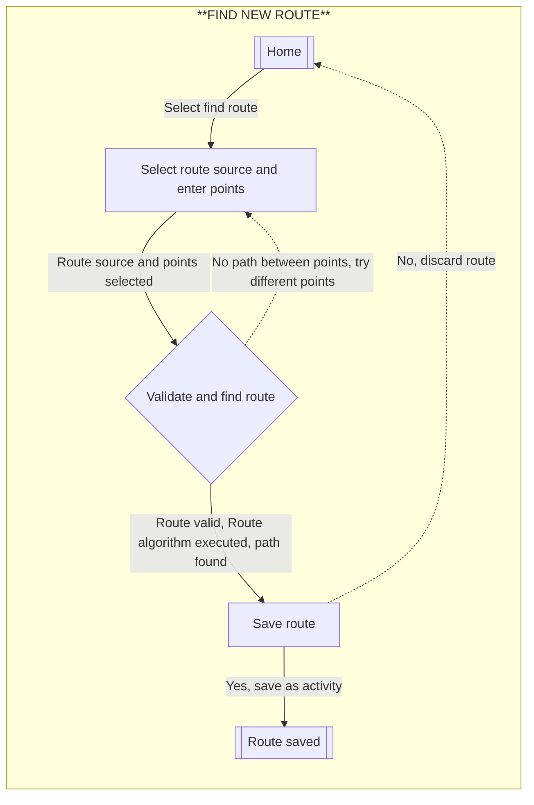
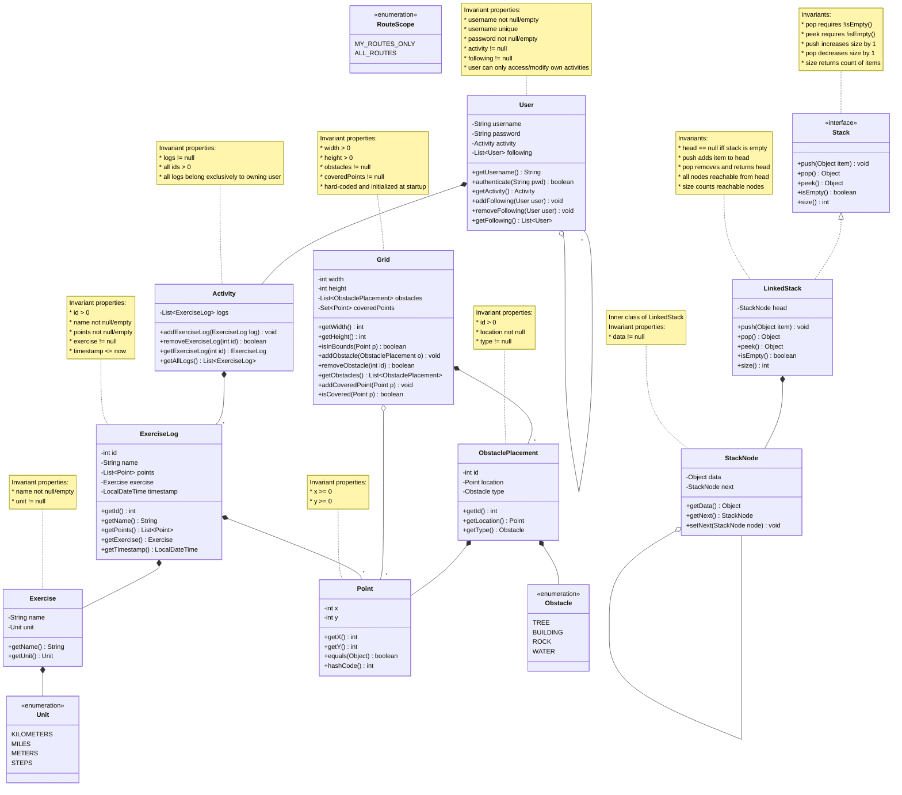

## Resources

*mermaid flow chart syntax: <https://mermaid.ai/open-source/syntax/flowchart.html>

# Flows of Interaction

## Diagrams

### Overall Flow



#### Create or Select User Profile



#### Edit User Profile



#### Logout



#### Add Activity



#### View Feed & Follow Users



#### Find New Route



# REPL

## Building and Running the REPL

The project has been built and tested to be run in IntelliJ. Open the project
there, open the "ca.umanitoba.cs.kanand" folder, then the "Main.java" file.
Finally, click "Run" in the top menu bar!

## Additional Commands

I've added the following commands to support the Exercise Tracker application:

* `CREATE PROFILE` - Create a new user profile with username and password
* `LOGIN` - Select and login to an existing user profile
* `LOGOUT` - Log out of current profile
* `EDIT PROFILE` - Modify username or password
* `FOLLOW USER` - Follow another user to see their activities in feed
* `SHOW FEED` - Display activity feed from followed users
* `ADD MAP` - Initialize the world map with specified width and height
* `ADD ACTIVITY` - Track a new activity with a route on the map
* `SHOW ACTIVITY` - Display map with a single activity's route
* `ADD OBSTACLE` - Add an obstacle to the map
* `FIND ROUTE` - Use path-finding to discover new routes on the map
* `SHOW OBSTACLES` - List all obstacles on the map
* `REMOVE ACTIVITY` - Remove an activity by ID
* `REMOVE OBSTACLE` - Remove an obstacle by ID
* `REMOVE MAP` - Remove the entire map
* `EXIT` - Quit the application

## Domain Model

### Resources

* I learned about Java design patterns and domain modeling at
  <https://www.baeldung.com/>.
* I learned about stack data structures and linked list implementations from
  <https://www.geeksforgeeks.org/stack-data-structure-introduction-and-program/>.
* I referenced constraint checking practices from Guava library documentation
  <https://github.com/google/guava>.
* I studied graph traversal and path-finding algorithms at
  <https://www.baeldung.com/java-graphs#dfs-stack>.

### Changes

**For Phase 3, I made the following significant changes to support multi-user functionality, activity feeds, and path-finding:**

* **Added `User` class** - Represents a user profile with username, password, and owned activities. Supports multiple people using the same application instance.

* **Added `Stack` interface and `LinkedStack` implementation** - Required for the stack-based path-finding algorithm. `Stack` defines push/pop operations; `LinkedStack` implements using a linked list structure. Invariants and contracts are fully specified through preconditions, postconditions, and state requirements in the Javadoc.

* **Added `StackNode` inner class** - Used by `LinkedStack` for linked list structure. Includes invariant that `data != null` and maintains proper node chaining for path-finding algorithm.

* **`Grid` class as hard-coded map** - The map is hard-coded and initialized when the software starts. It begins completely empty with no obstacles, but users can add obstacles as they encounter them during activities. Also maintains reference to which points have been covered by routes, enabling path-finding queries.

* **Added `RouteScope` enum** - Supports two path-finding modes: "MY_ROUTES_ONLY" (personal activities) or "ALL_ROUTES" (from feed with followed users).

### Diagram

Here is the domain model for the Exercise Tracker. This design supports multi-user profiles, activity tracking on a hard-coded grid map, path-finding with stack ADT, and activity feeds for following other users. **All invariants are documented in class notes** to ensure the model maintains valid states at all times.



# Phase 4 Implementation

## Running the Application

The functional application can be started by running the `main` method in `Main.java`.

To start the application:
1. Build: `mvn clean compile`
2. Run: `mvn exec:java -Dexec.mainClass="ca.umanitoba.cs.kanand.Main"`
3. Or run `Main.java` directly from your IDE

## Architecture & Design Decisions

### UI Layer Separation
For Phase 4, I created a clean separation of concerns by introducing an explicit **UI layer** (`ExerciseTrackerUI` in the `ui` package) that handles all user interaction and input validation. This follows the pattern demonstrated in the professor's 2450-hack example project.

**Design benefits:**
- **Single Responsibility Principle**: UI layer handles all input/output; logic layer handles business logic; model layer encapsulates domain logic
- **Input Validation**: All user input is validated in the UI layer before being passed to the logic layer
- **Error Handling**: Custom exceptions flow from model → logic → UI, providing clear error messages to users
- **Testability**: Logic layer can be tested independently without UI

### Project Structure
```
src/main/java/ca/umanitoba/cs/kanand/
├── Main.java                          # Entry point
├── model/                             # Domain model
│   ├── User.java
│   ├── Activity.java
│   ├── ExerciseLog.java
│   ├── Exercise.java
│   ├── Grid.java
│   ├── Point.java
│   ├── ObstaclePlacement.java
│   ├── Obstacle.java (enum)
│   ├── Unit.java (enum)
│   ├── RouteScope.java (enum)
│   ├── PathFinder.java
│   ├── Stack.java (interface)
│   └── LinkedListStack.java
├── logic/                             # Business logic layer
│   └── ExerciseTrackerLogic.java
├── ui/                                # User interface layer (NEW)
│   └── ExerciseTrackerUI.java
├── printers/                          # Output formatting
│   ├── ExerciseLogPrinter.java
│   ├── ExercisePrinter.java
│   ├── ObstaclePlacementPrinter.java
│   └── PointPrinter.java
└── exceptions/                        # Custom exceptions
    ├── InvalidActivityException.java
    ├── InvalidCredentialsException.java
    ├── InvalidPathException.java
    ├── InvalidPointException.java
    ├── MapNotInitializedException.java
    └── UsernameTakenException.java
```

## Phase 4 Features Implemented

### 1. User Authentication & Multi-User Support
- Users can create new accounts with username/password validation
- Users can login to existing accounts
- Passwords validated for minimum length and non-empty
- Usernames must be unique and non-empty
- Custom exception handling with clear error messages

### 2. Activity Feed & Social Following
- Users can view an activity feed of all activities from users they follow
- Users can browse other users and toggle follow status
- Following users enables seeing their activities in the feed
- Users cannot follow themselves

### 3. Adding Activities with Route Options
- Users can enter a new activity with name, exercise type, unit, and distance
- Users can copy a previous route from their own activities
- Users can manually enter a new route (sequence of coordinates)
- Input validation ensures distance is positive, route has at least 1 point
- Optional: Users can add obstacles encountered during the activity

### 4. Finding Routes via Pathfinding Algorithm
- Users can search for routes using stack-based pathfinding algorithm
- Two scope options:
  - **MY_ROUTES_ONLY**: Find path using only own previous routes
  - **ALL_ROUTES**: Find path using routes from all followed users
- Found routes can be converted directly into new activities
- PathFinder uses stack ADT to implement backtracking algorithm

### 5. Profile Management
- Users can change their username (with uniqueness validation)
- Users can change their password (requires current password verification)
- Changes are validated for empty/invalid input

## Input Validation Strategy

### UI Layer Validation
- **Username**: Non-empty, minimum 3 characters, unique (for registration)
- **Password**: Non-empty, minimum 3 characters, correct verification (for change)
- **Distance**: Must be positive numeric value
- **Coordinates**: Valid integers within grid bounds
- **Enums**: Validated against allowed values (Unit, Obstacle types)

### Logic Layer Validation
- Verifies user exists and credentials match (LoginUser)
- Verifies username uniqueness before account creation
- Coordinates are validated to be within grid bounds

### Domain Model Validation
- All class invariants are checked via preconditions and postconditions
- Stack operations validated (pop/peek on non-empty only)
- Point coordinates always non-negative

## Error Handling & Reporting

### Exception Hierarchy
- `UsernameTakenException`: Indicates username already in use
- `InvalidCredentialsException`: Login credentials don't match
- `MapNotInitializedException`: Map accessed before initialization
- `InvalidPathException`: Pathfinding algorithm encountered invalid state
- `InvalidPointException`: Point outside bounds or invalid
- Generic `NumberFormatException`: Caught and reported as user-friendly message

### User-Friendly Error Messages
All errors are caught at the UI layer and presented with clear guidance:
- ✗ Indicates error condition
- ✓ Indicates successful operation
- Specific guidance on fixing the problem (e.g., "Username must be at least 3 characters")

## Design by Contract Implementation

### Preconditions
- Methods check that parameters are not null
- Methods validate that inputs meet minimum requirements
- For pathfinding: start/end points must be in bounds

### Postconditions
- User successfully created iff added to users list
- User successfully logged in iff currentUser set correctly
- Route successfully added iff found in user's activity list
- Password successfully changed iff authenticate succeeds with new password

### Invariants
- Users list is never null
- Current user, if not null, must be in users list
- Grid, if not null, is properly initialized
- All domain model classes maintain documented invariants

## No REPL in Phase 4

As specified in the requirements, the original REPL is not part of Phase 4 grading. Instead, the grading staff will:
- Test the application through the UI by entering invalid inputs
- Verify input validation prevents crashes
- Verify error messages are clear and helpful
- Verify all flows (authentication, add activity, find route, etc.) work correctly


